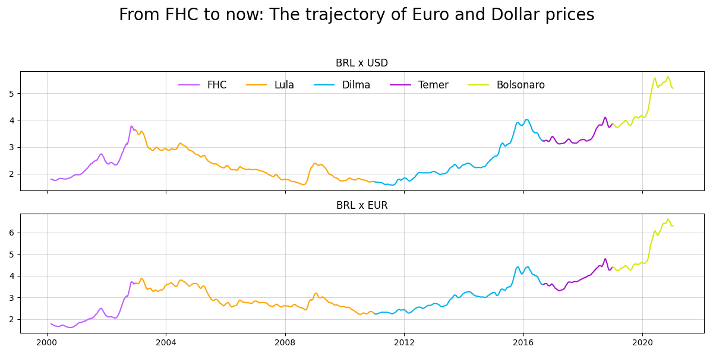

# From FHC to now: The trajectory of Euro and Dollar prices

Implementação de análise da trajetória dos preços do EUR e USD em relação ao BRL no decorrer dos governos dos últimos 5 presidentes do Brasil.

Baseada no projeto guiado "Storytelling Data Visualization on Exchange Rates" da plataforma Dataquest.io para avaliação na disciplina de MLOps, com o professor Ivanovitch Silva.

Após a implementação inicial da solução no Jupyter Notebook, este foi transformado em um script para aplicação de práticas de código limpo de acordo com o PEP8, por meio do site "PEP8 online check" e da ferramenta "pylint".

Bibliotecas utilizadas: pandas e matplotlib.

Score final do pylint: 10.0